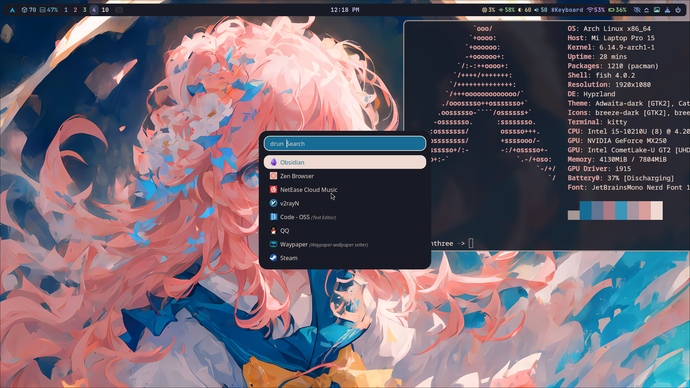
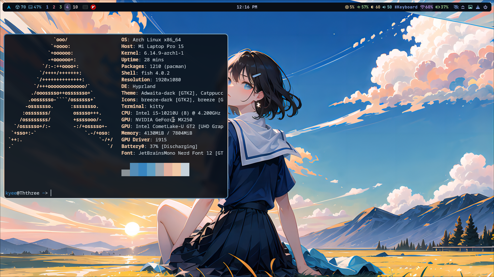
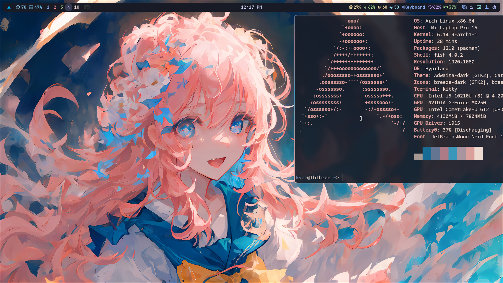
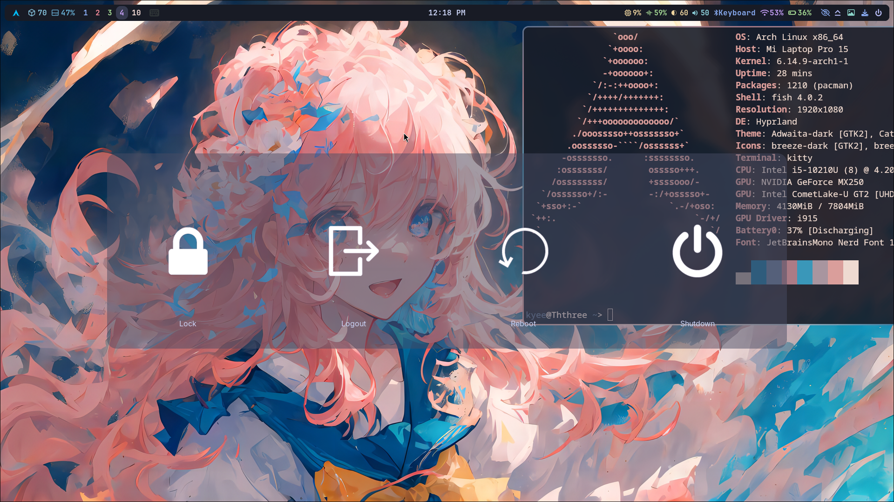
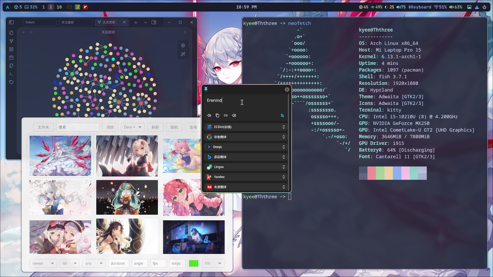
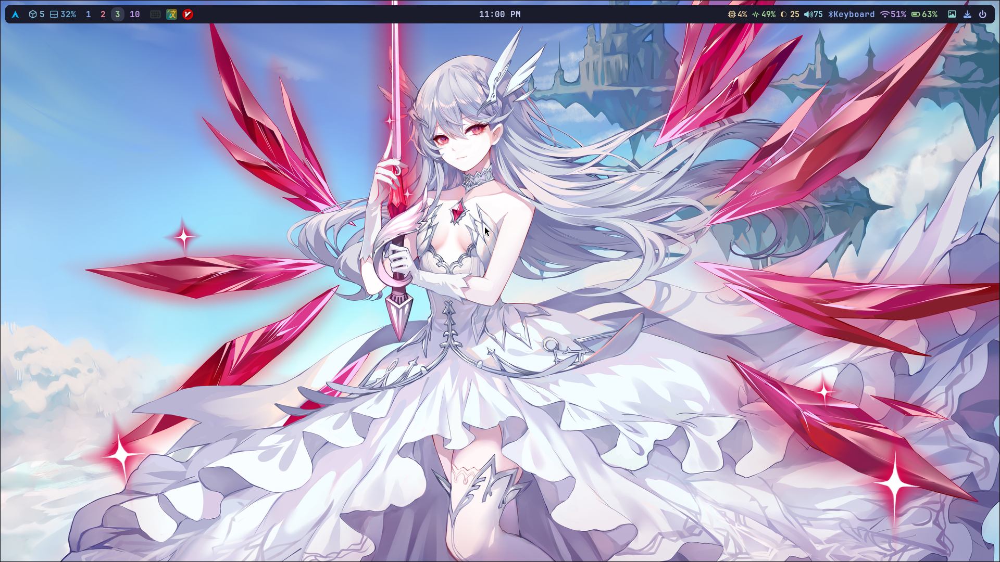
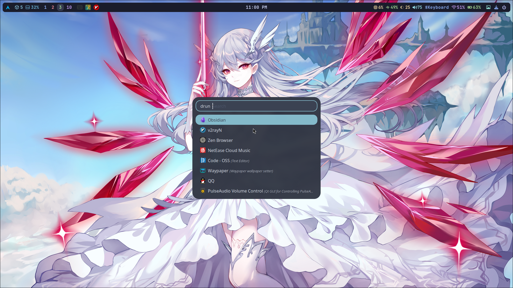

# 2025-06
- add hyprland plugins:hyprexpo,hyprspace
- use pywal to change waybar rofi and hyprland border colors.
- add some notifycation:low battery, charging notification,full battery notification,discharging notification,get random wallpaper,remove wallpaper.
- add increase volume, decrease volume, mute volume, increase brightness, decrease brightness notificaiton.
- add wlogout
- change hyprland animation
- waybar add buttions:hidden waybar,change caps lock to esc

## previews
<b>rofi & waybar</b> 

 
<b>pywal & hyprland border</b> 

 
<b>wlogout</b> 

# 2025-02
## 效果
| hyprland | waybar | rofi |
| --- | --- | --- |
| |  |  |

## 依赖
- waypaper
- swww
- waybar
- rofi
- python
- hyprland
- ...

## 使用说明
对于配置文件，先备份自己的配置文件（如果需要的话），然后将仓库中的配置文件放在`~/.config/`的相应位置下即可

对于33文件夹，将33文件夹移动到`~/`下，否则一些功能无法使用。（包括随机壁纸（从本地随机选取），和从互联网随机下载一张图片作为壁纸, 和检测可更新包的数量）。或者你可以将其中的文件放在其他文件夹，然后去更改配置文件中的路径。

将rofi的配置文件移动到`~/.config/rofi/`下后，执行`rofi-theme-selector`选择主题，

将壁纸放在`~/33/wallpaper/wallpapers/`下，或者你可以放在自己喜欢的文件夹下，然后更改相关的配置。

## 功能说明
你可以直接研究配置文件来看具体有那些功能（推荐），或者看下面的介绍 
**waybar** 
左边第一个arch图标可启动rofi, 
第二个图标那会显示可更新包的数量， 
第三个图标那显示以使用的空间，左键打开文件管理器。 
右侧的壁纸图标左键可以随机更换壁纸，右键打开waypaper选择壁纸 
右侧的下载图标左键从网上随机下载一张图片并作为壁纸，下载的壁纸储存在`~/33/wallpaper/wallpapers/`下;右键是将当前的壁纸移动到`~/33/wallpaper/dislikes/`下。 
电源图标，左键点击一下就会关机（不要随便点）⚠

> [!TIP]
> 要能够编写自己的配置文件，别人的只作为参考
> 遇到问题时，自己多思考，多研究,说给我自己的.